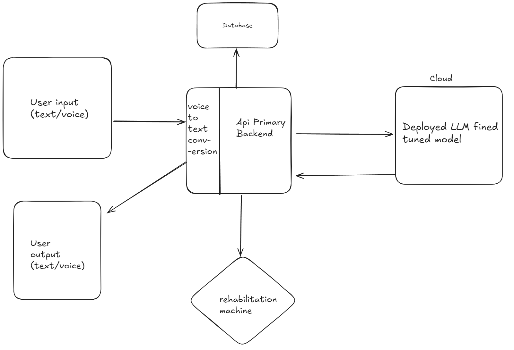

# LLM-Based User Interaction for Stroke Rehabilitation Systems

## Overview

This project aims to develop a rehabilitation machine that uses a fine-tuned language model to interpret user inputs and convert them into actionable commands. The system will also include real-time Text-to-Speech (TTS) for enhancing patient morale through interactive conversations.

## Project Components

1. **Dataset Preparation**
   - Collect and preprocess data with user inputs and corresponding machine actions.
   - Options include using synthetic data or manually creating datasets.

2. **Model Training**
   - Train a base LLM model (e.g., GPT or Llama) to handle the mapping of user inputs to machine commands.

3. **Input Conversion**
   - Implement a voice-to-text conversion system to process voice inputs into text.

4. **User Interface**
   - Develop a user interface that supports both text and voice inputs.
   - Optionally include features for collecting medical information to improve accuracy.

5. **Data Storage & API Backend**
   - Store interaction data and conversations in a database.
   - Create an API backend for managing data storage and retrieval.

6. **Game Integration**
   - Design and integrate three games with high-quality graphics.
   - Explore VR and joystick input integration for user interaction.

7. **Real-Time TTS System**
   - Implement a real-time TTS system for a conversation bot to uplift patient morale.

## System Design


The system design includes the following components:
- **Data Pipeline**: For data collection, preprocessing, and storage.
- **Model Training**: To fine-tune the LLM model.
- **Input Conversion**: Voice-to-text and text processing systems.
- **User Interface**: Frontend development for user interactions.
- **API Backend**: For data management and communication.
- **Game Development**: Integration of games with VR and joystick support.
- **TTS System**: Real-time TTS for interactive conversations.

## Getting Started

1. **Clone the Repository**
   ```bash
   git clone https://github.com/yourusername/repository-name.git
   ```

2. **Install Dependencies**
   ```bash
   cd repository-name
   pip install -r requirements.txt
   ```

3. **Set Up the Environment**
   - Configure environment variables as needed.
   - Set up database and API services.

4. **Run the Application**
   ```bash
   python app.py
   ```

